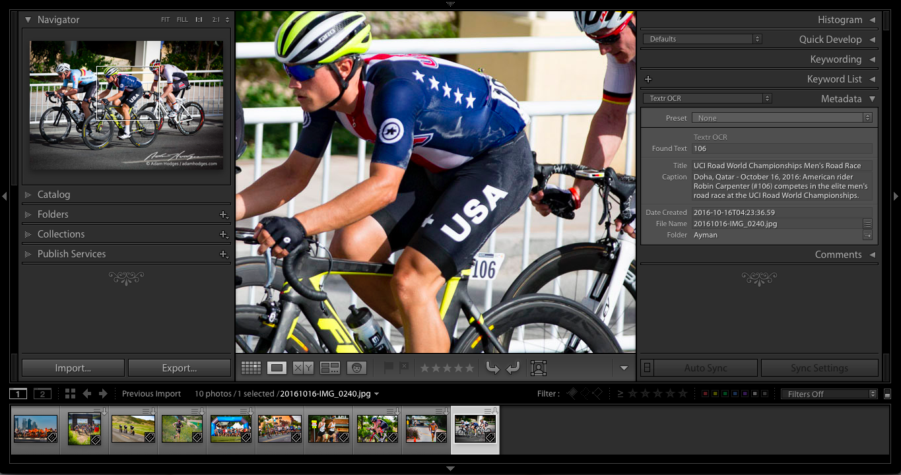
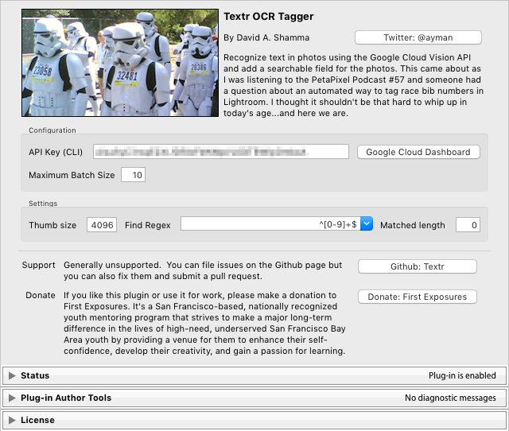

# Textr Plug-In for Lightroom #

Recognize text in photos using the Google Cloud Vision API and
annotate metadata for the photos.

## About

This is a small experiment.  You supply your API key for Google
Cloud Services and you can select a photo and query Google's API for
what text might be in the photo.  Found text is added as searchable
custom metadata.

This came about as I was listening to
the [PetaPixel Podcast #57][PPP57] and someone had a question about an
automated way to tag race bib numbers in Lightroom.  Sharky said it
wasn't something he heard of.  I thought it shouldn't be that hard to
whip up in today's age...and here we are.

[PPP57]: https://petapixel.com/2016/03/20/ep-57-strobist-david-hobby-sticks-consumers/

There are a few settings for the plug-in which you'll have to
tune. I'll get to those later

## How to use this plug-in

I have a Mac. I assume Windows will be similar. Just a heads up.

### Install the Plug-In

You do this in the usual manner.  Put the plug-in somewhere you like.
In the **File** menu, select *Plug-in Manager* and click *Add*.

### Configuration

#### API Key (CLI)

You need this to use the Google Cloud Vision API.  They give you a few
hundred queries for free, *then they start charging you*.  Not much but
just be aware of this.

##### How to get an API key for Google Cloud Services

It's not too bad but not totally easy...as of the time I wrote this
plug-in, [Google had these instructions to follow][apikey].  Do that
and paste the about 40 character key in the Configuration section of
the plug-in manager page.  Don't worry, Lightroom will remember it.

[apikey]: https://support.google.com/cloud/answer/6158862?hl=en "Google Help Page"

#### Maximum Batch Size

Quite simply, how many can you send to the cloud at once. I put this
here to limit my runs in the odd case that one accidentally sends
15,000 photos to the cloud.  Mostly because this would take time and
cost money.  This is *per batch* so you can run several batches and
exceed this number.  I might kill this setting in the future and just
cap a run artificially at 500.

### Settings 

You can set the settings in the Plug-in Manager or when you run the
plug-in.

#### Thumb size

The plugin sends thumbnails to the cloud for speed and
performance. Smaller thumbnails will result in less text being
seen. For example, if a bib says `Runner` in a smaller font than the
number `E12345`, the Cloud Vision Api won't get the word `Runner` if
you pick a smaller thumb.  I'd recommend playing with this setting to
get the right setting for a batch of photos.

#### Find Regex

This is where it gets fun. If a bib number scheme for a race is just
numbers, you can set this to only pick up numbers.  Or if it's just
text, same deal . It defaults to a mix of numbers and text.  You can
hover to get a tooltip to help you pick or if you are familiar, you
can write your own.

  * *Letters and numbers:* `^[a-zA-Z0-9]+$`
  * *Numbers only:* `^[0-9]+$`
  * *Letters only:* `^[a-zA-Z]+$`
  
Basically these are the options I put in place.  You could try
`^[a-zA-Z][0-9]+$` to pick up a letter followed by a set of numbers
for example. Note that if it's set to letters, other characters (like
Chinese or Arabic) won't get picked up.

#### Matched length

In conjunction with the *Regex*, you can use this setting to say how
long the bib number should be.  Only strings of this size will be
returned, if it's set to the default of `0`, any size will match.
Keep in mind, if a bib is partially hidden by a runner or other
interference, it won't pick up the partial number. So if you set this
to `4` and have two runners: `1234` and `5678` and the `5` is hidden
by a runner's hand, the API will find `1234` only...`678` won't be
annotated by the plugin.

### Running the plug-in

Select a few photos and go to the **Library** menu and select *Plug-in
Extras* and select *Textr OCR*.  The settings here are the same as the
global ones but you can tweak them at runtime. The plug-in will
generate thumbnails and then call the cloud in a batch.  The Textr
stores a single custom metadata string that is searchable but won't
clutter your existing metadata or keywords.  Text recognition can be
kinda noisy, so I didn't want to mess up any nice categorization
people may have.

### Undo Please
Remember you can **undo** this task when it completes too. Or just
select all the photos and empty out that one field in the Textr
metadata panel. Or just tweak the settings and re-run, it will replace
the existing custom metadata.

## This is cool! Is it free? 

Glad you like it! It's free but
please [donate to First Exposures][FirstExposures]; it's a San
Francisco-based, nationally recognized youth mentoring program that
strives to make a major long-term difference in the lives of
high-need, underserved San Francisco Bay Area youth by providing a
venue for them to enhance their self-confidence, develop their
creativity, and gain a passion for learning. This plug-in is free and
under a nice MIT License. Google gives you some queries for free, then
you have to pay them for more.  If you like this plug-in (especially
if this helps your business out)...send a donation to this nice
non-profit (pay it forward yo).  I'm not going to limit or cripple the
plug-in.  Just if you like it, send a donation. :-) Sorry to say,
Google will continue to charge you beyond their free query limit.

[FirstExposures]: http://www.firstexposures.org/ "Donate please!"

## There's a problem with the plugin!

It happens. File an issue! Or find an existing issue and fix it and
send me a pull request.

## Thanks!

Thanks to [Adam Hodges][adam] for giving me permission to use his 
images here. Check him out at [Adam Hodges Photography][adam].

[adam]: https://adamhodges.com/ "Adam Hodges Photography"

## License ##

This code is under the MIT License permissive license.  You can do
anything you want with the code, just cite me back and I'm not liable
for anything.  FTR, I tested this on about 20 photos. Just saying. 
